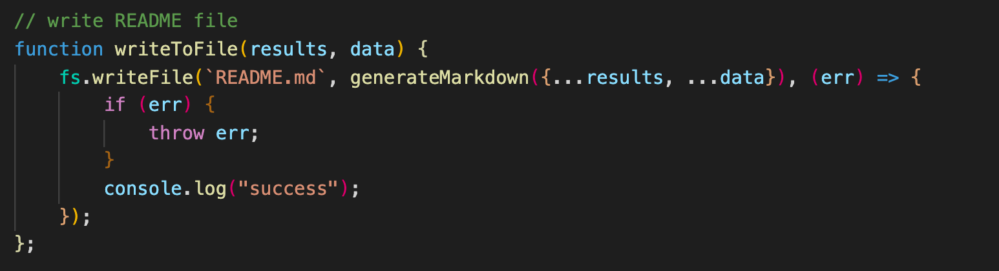
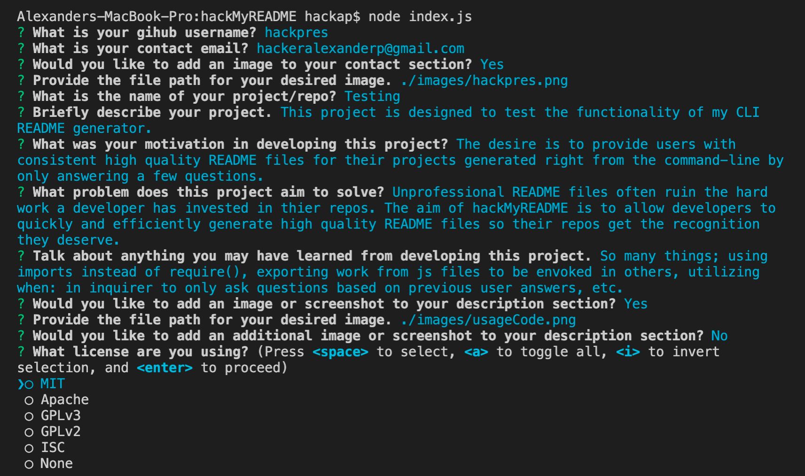
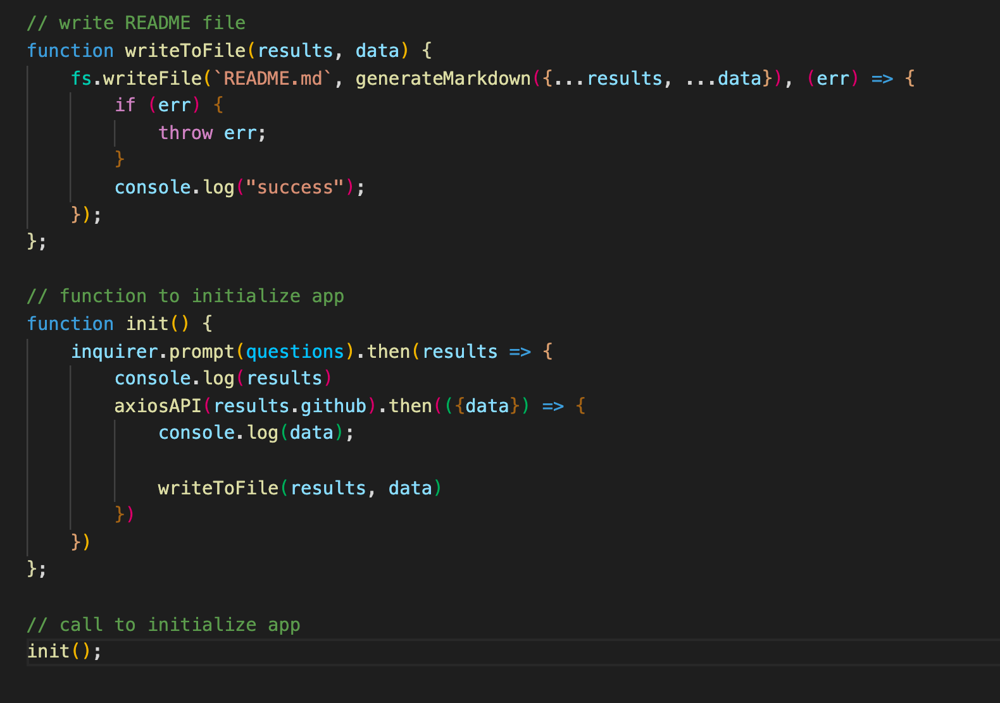

# hackMyREADME.


## Description
This project is designed to test the functionality of my CLI README generator.

    The desire is to provide users with consistent high quality README files for their projects generated right from the command-line by only answering a few questions.

    Unprofessional README files often ruin the hard work a developer has invested in thier repos. The aim of hackMyREADME is to allow developers to quickly and efficiently generate high quality README files so their repos get the recognition they deserve.

    So many things; using imports instead of require(), exporting work from js files to be envoked in others, utilizing when: in inquirer to only ask questions based on previous user answers, etc.

<br/>


## Table of Contents

* **[Installation](#installation)**<br />
* **[Usage](#usage)**<br />
* **[License](#license)**<br />
* **[Tests](#tests)**<br />
* **[Contributing](#contributing)**<br />
* **[Contact](#contact)**<br />

### Installation
<a name="installation"/>

```
npm i
```

### Usage
<a name="usage"/>
Install and run this repo directly from your command line! simply type "node index.js" in the code directory to run the file in node, then answer the question prompts!<br/>

<br/>


### License
<a name="license"/>
<a href="https://choosealicense.com/licenses/MIT">MIT</a>

### Tests
<a name="tests"/>

```
npm test
```

### Contributing
<a name="contributing"/>
hackpres is the primary contributor.


### Contact
<a name="contact"/>
for questions please contact <a href="https://github.com/hackpres">hackpres</a> at hackeralexanderp@gmail.com.<br/>

